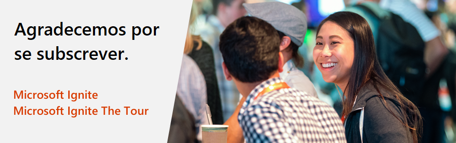

# Microsoft Ignite e Microsoft Ignite The Tour: Oferta de exame de certificação gratuito

<em><strong>Atualizado em 26 de março de 2020:</strong> Devido ao coronavírus (COVID-19), a Microsoft está estendendo as ofertas de exames para 31 de janeiro de 2021. Isso significa que a oferta do exame de certificação para esses eventos, originalmente válida por 180 dias, agora é válida até 31 de janeiro de 2021. <a href="https://aka.ms/covid-19certannoucement">Saiba mais</a>. A alteração é descrita em detalhes a seguir.</em>

Obrigado por participar do Microsoft Ignite 2019 ou de um evento do Microsoft Ignite The Tour 2019-2020. Todos os participantes receberão um exame de certificação gratuito, sujeito aos [termos e condições](#terms-and-conditions), para ajudá-lo a continuar aprimorando e comprovando seus conhecimentos técnicos aos empregadores e colegas de trabalho.

## Detalhes da oferta

Se você participou do Microsoft Ignite 2019 ou de um evento do Microsoft Ignite The Tour 2019-2020, pode se qualificar para receber um exame gratuito de certificação básica, com base em uma função ou especialidade da Microsoft. A oferta de exame gratuito está disponível para resgate a partir do início do evento em que você estiver participando e é válida até 31 de janeiro de 2021. Se você não agendar e se inscrever para um exame qualificado dentro desse prazo, não poderá resgatar sua oferta.  

##  Como solicitar seu exame gratuito

Siga as instruções passo a passo abaixo para solicitar seu exame gratuito.

**Passo 1:** Selecione um dos [Exames qualificados](#eligible-exams-for-this-offer) e clique no botão "Agendar exame" para iniciar o processo de registro online.  

**Passo 2:** Entre no seu Perfil de Certificação Microsoft existente ou crie um usando uma conta da Microsoft.  

**Passo 3:** Depois de fazer login no seu perfil de certificação, verifique se os detalhes no seu perfil de certificação estão corretos.  

**Passo 4:** Clique no botão “Salvar e continuar” na parte inferior da página Perfil de Certificação para prosseguir para a página “Descontos para exames”.  

**Passo 5:** Na página "Descontos no exame", digite o e-mail que você usou para se registrar em um evento (por exemplo: alias@company.com ou alias@outlook.com).  

**Passo 6:** Se você tiver direito a um desconto no exame, receberá um e-mail de verificação no endereço informado. Você deve digitar a senha recebida no e-mail para continuar. Se você não receber um e-mail, poderá solicitar o reenvio do código.  

**Passo 7:** Depois de digitar a senha correta, você será solicitado a vincular suas contas. Você DEVE concordar em vincular suas contas para receber um desconto.  

Na próxima vez que fizer login, se tiver direito a descontos nos exames em qualquer uma dessas contas, os descontos serão exibidos automaticamente. Para remover uma conta, vá para o [Painel de certificação](https://aka.ms/certdashboard) e clique em “Edite seu perfil de certificação”.

**Passo 8:** Você verá um desconto mostrado na parte superior. Escolha o desconto que deseja utilizar e continue com a finalização da compra clicando no botão do exame agendado.  

**Passo 9:** Siga as informações nas telas subsequentes e forneça os detalhes necessários para agendar seu exame. Durante o processo de checkout, verifique se o valor total devido é de $ 0,00 e envie o pedido.  

**Suporte para certificação:**

Para problemas ao agendar seu exame, obtenha ajuda nos [fóruns de suporte da Microsoft Certification](https://trainingsupport.microsoft.com/mcp/forum?sort=LastReplyDate&dir=Desc&tab=All&status=all&mod=&modAge=&advFil=&postedAfter=&postedBefore=&threadType=All&isFilterExpanded=false&page=1). O moderador do fórum responderá em um dia útil.

##  Exames autorizados para esta oferta

Esta oferta inclui todos os fundamentos da Microsoft, exames de certificação baseados em funções e de especialidade. Os exames oferecidos estão listados abaixo.

| Por produto | Exames |
| --- | --- |
| Azure | [AI-100: Designing and Implementing an Azure AI Solution](/learn/certifications/exams/ai-100) [AI-900: Microsoft Azure AI Fundamentals](/learn/certifications/exams/ai-900) [AZ-103: Microsoft Azure Administrator](/learn/certifications/exams/az-103) [AZ-104: Microsoft Azure Administrator (nova versão)](/learn/certifications/exams/az-104) [AZ-120: Planning and Administering Microsoft Azure for SAP Workloads](/learn/certifications/exams/az-120) [AZ-203: Developing Solutions for Microsoft Azure](/learn/certifications/exams/az-203) [AZ-204: Developing Solutions for Microsoft Azure (nova versão)](/learn/certifications/exams/az-204) [AZ-220: Microsoft Azure IoT Developer](/learn/certifications/exams/az-220) [AZ-300: Microsoft Azure Architect Technologies](/learn/certifications/exams/az-300) [AZ-301: Microsoft Azure Architect Design](/learn/certifications/exams/az-301) [AZ-303: Microsoft Azure Architect Technologies](/learn/certifications/exams/az-303) [AZ-304: Microsoft Azure Architect Design](/learn/certifications/exams/az-304) [AZ-400: Designing and Implementing Microsoft DevOps Solutions](/learn/certifications/exams/az-400) [AZ-500: Microsoft Azure Security Technologies](/learn/certifications/exams/az-500) [AZ-900: Microsoft Azure Fundamentals](/learn/certifications/exams/az-900) [DA-100: Analyzing Data with Microsoft Power BI](/learn/certifications/exams/da-100) [DP-100: Designing and Implementing a Data Science Solution on Azure](/learn/certifications/exams/dp-100) [DP-200: Implementing an Azure Data Solution](/learn/certifications/exams/dp-200) [DP-201: Designing an Azure Data Solution](/learn/certifications/exams/dp-201) [DP-300: Administering Relational Databases on Microsoft Azure](/learn/certifications/exams/dp-300) [DP-900: Microsoft Azure Data Fundamentals](/learn/certifications/exams/dp-900) |
| Dynamics 365 and Power Platform | [MB-200: Microsoft Power Platform + Dynamics 365 Core](/learn/certifications/exams/mb-200) [MB-210: Microsoft Dynamics 365 Sales](/learn/certifications/exams/mb-210) [MB-220: Microsoft Dynamics 365 Marketing](/learn/certifications/exams/mb-220) [MB-230: Microsoft Dynamics 365 Customer Service](/learn/certifications/exams/mb-230) [MB-240: Microsoft Dynamics 365 Field Service](/learn/certifications/exams/mb-240) [MB-300: Microsoft Dynamics 365: Core Finance and Operations](/learn/certifications/exams/mb-300) [MB-310: Microsoft Dynamics 365 Finance](/learn/certifications/exams/mb-310) [MB-320: Microsoft Dynamics 365 Supply Chain Management, Manufacturing](/learn/certifications/exams/mb-320) [MB-330: Microsoft Dynamics 365 Supply Chain Management](/learn/certifications/exams/mb-330) [MB-400: Microsoft Power Apps + Dynamics 365 Developer](/learn/certifications/exams/mb-400) [MB-500: Microsoft Dynamics 365: Finance and Operations Apps Developer](/learn/certifications/exams/mb-500) [MB-600: Microsoft Dynamics 365 + Power Platform Solution Architect](/learn/certifications/exams/mb-600) [MB-700: Microsoft Dynamics 365: Finance and Operations Apps Solution Architect](/learn/certifications/exams/mb-700) [MB-901: Microsoft Dynamics 365 Fundamentals](/learn/certifications/exams/mb-901) [PL-100: Microsoft Power Platform App Maker](/learn/certifications/exams/pl-100) [PL-900: Microsoft Power Platform Fundamentals](/learn/certifications/exams/pl-900) |
| Microsoft 365 | [MD-100: Windows 10](/learn/certifications/exams/md-100) [MD-101: Managing Modern Desktops](/learn/certifications/exams/md-101) [MS-100: Microsoft 365 Identity and Services](/learn/certifications/exams/ms-100) [MS-101: Microsoft 365 Mobility and Security](/learn/certifications/exams/ms-101) [MS-200: Planning and Configuring a Messaging Platform](/learn/certifications/exams/ms-200) [MS-201: Implementing a Hybrid and Secure Messaging Platform](/learn/certifications/exams/ms-201) [MS-203: Microsoft 365 Messaging](/learn/certifications/exams/ms-203) [MS-300: Deploying Microsoft 365 Teamwork](/learn/certifications/exams/ms-300) [MS-301: Deploying SharePoint Server Hybrid](/learn/certifications/exams/ms-301) [MS-500: Microsoft 365 Security Administration](/learn/certifications/exams/ms-500) [MS-600: Building Applications and Solutions with Microsoft 365 Core Services](/learn/certifications/exams/ms-600) [MS-700: Managing Microsoft Teams](/learn/certifications/exams/ms-700) [MS-900: Microsoft 365 Fundamentals](/learn/certifications/exams/ms-900) |

## FAQ

### Sobre a oferta

**P: Quantos exames posso agendar gratuitamente com esta oferta?**

**R:** Você pode reivindicar um exame de certificação qualificado gratuito com esta oferta. A oferta é um exame elegível gratuito, mesmo se você atender vários eventos da Microsoft Ignite.

**P: Quais exames de certificação são qualificados para esta oferta?**

**R:** Esta oferta inclui todos os fundamentos da Microsoft, exames de certificação baseados em funções e de especialidade. Para obter uma lista dos exames de certificação qualificados, consulte a seção "Exames qualificados para esta oferta" em nossa página de detalhes da oferta: [https://docs.microsoft.com/learn/certifications/microsoft-ignite-free-certification-exam-offer#eligible-exams-for-this-offer](https://docs.microsoft.com/learn/certifications/microsoft-ignite-free-certification-exam-offer#eligible-exams-for-this-offer).

**P: Caso tenha me inscrito em um evento qualificado, mas não participei pessoalmente, ainda posso resgatar esta oferta?**

**R:** Esta oferta de exame é válida apenas para pessoas que participaram pessoalmente do evento Microsoft Ignite 2019 ou Microsoft Ignite The Tour 2019-2020.

**P: Seu eu me registrei para um evento elegível, mas o evento foi cancelado, eu ainda posso reivindicar esta oferta?**

**R:** Não. A oferta do exame de certificação é uma extensão da experiência no local e se o evento for cancelado, a oferta do exame de certificação está indisponível. Todavia, encorajamos você a continuar o aprendizado com treinamento gratuito e interativo em [Microsoft Learn](https://docs.microsoft.com/learn/)!

**P: Porque os termos e condições desta oferta afirmam que os moradores de Israel, Alemanha ou Suécia são inelegíveis?**

**R:** Os moradores desses territórios são inelegíveis para esta oferta devido à política de presentes da Microsoft e leis locais. Cada um desses países possui leis específicas que limitam o que qualquer empresa pode oferecer a seus funcionários e o valor de nossos exames de certificação excedem os limites, portanto, a Microsoft não pode oferecer aos residentes desses países um exame gratuito.

### Agendamento de seu exame gratuito

**P: Eu preciso agendar meu exame gratuito desta oferta _durante_ o evento em que eu compareci ou planejo comparecer?**

**R:** Não, você não precisa agendar seu exame gratuito desta oferta durante o evento em que você compareceu. Você pode agendar o exame durante ou após o evento, pois a oferta de exame gratuito expira em 31 de janeiro de 2021.

**P: Preciso fazer o exame antes de 31 de janeiro de 2021?**

**R:** Sim, você precisa fazer o exame antes de 31 de janeiro de 2021.

**P: Como faço para agendar meu exame gratuito com esta oferta?**

**R:** Para obter instruções sobre como agendar seu exame gratuito, acesse [https://docs.microsoft.com/learn/certifications/microsoft-ignite-free-certification-exam-offer#how-to-claim-your-free-exam](https://docs.microsoft.com/learn/certifications/microsoft-ignite-free-certification-exam-offer#how-to-claim-your-free-exam).

**P: Quando verificando minha elegibilidade de desconto de exame, me deparo com um erro afirmando que estou inelegível porque sou um agente do governo mas eu não sou. O que devo fazer?**

**R:** Se você foi identificado incorretamente como um agente do governo, você precisará atualizar o campo de governo no seu perfil de registro de evento e esperar até que o evento acabe para ver a elegibilidade. Você também pode entrar em contato com o [fórum de suporte de Microsoft Certification](https://trainingsupport.microsoft.com/mcp/forum?sort=LastReplyDate&dir=Desc&tab=All&status=all&mod=&modAge=&advFil=&postedAfter=&postedBefore=&threadType=All&isFilterExpanded=false&page=1) ([https://aka.ms/CertificationSupport](https://aka.ms/CertificationSupport)) para obter ajuda.

**P: Estou tendo problemas para agendar meu exame gratuito. Onde posso obter suporte?**

**R:** Para obter suporte, acesse o [fórum de suporte de Microsoft Certification](https://trainingsupport.microsoft.com/mcp/forum?sort=LastReplyDate&dir=Desc&tab=All&status=all&mod=&modAge=&advFil=&postedAfter=&postedBefore=&threadType=All&isFilterExpanded=false&page=1) ([https://aka.ms/CertificationSupport](https://aka.ms/CertificationSupport)). O moderador responderá em até um dia útil.

**P: Tenho a opção de fazer o exame agendado pessoalmente ou online?**

**R:** Sim, você tem a opção de fazer o exame agendado através da Pearson Vue pessoalmente em um centro de testes local ou via online supervisionado (OP). Para saber mais sobre os exames online, acesse
[https://docs.microsoft.com/learn/certifications/online-exams](/learn/certifications/online-exams)

### Política de cancelamento e reagendamento

**P: Posso reagendar minha inscrição para o exame desta oferta, se necessário?**

**R:** Sim, você pode reagendar sua inscrição para o exame, mas deve fazê-lo antes da data de vencimento da oferta. [Consulte a política de reagendamento](/learn/certifications/certification-exam-policies#cancellation-and-reschedule-policy) para mais informações.

**P: Será cobrada alguma taxa para reagendar ou cancelar minha inscrição no exame?**

**R:** Não há cobrança se você reagendar ou cancelar a inscrição para o exame pelo menos seis dias úteis antes da data de reagendamento. Se você precisar reagendar o exame cinco dias úteis antes da data do exame, deverá pagar uma taxa de reagendamento. Você não poderá reagendar ou cancelar o exame dois dias antes da data de realização do exame agendado. Se você não comparecer ao exame, não terá direito ao exame gratuito desta oferta. Para mais informações, veja [Política de Cancelamento Reagendamento](/learn/certifications/certification-exam-policies#cancellation-and-reschedule-policy).

**P: O que acontece se eu perdi minha marcação de exame e não reagendei ou a cancelei?**

**R:** Se você perdeu a marcação de seu exame e não reagendar ou cancelar sua marcação no mínimo 24 horas antes da sua marcação agendada, você perde seu exame gratuito desta oferta. Para mais informações, veja [Política de Cancelamento Reagendamento](/learn/certifications/certification-exam-policies#cancellation-and-reschedule-policy).

### Política de reaplicação

**P: Posso refazer um exame gratuitamente caso não tenha resgatado a oferta de exame de certificação gratuito?**

**R:** Não, a oferta é válida apenas para um evento e as reaplicações de exames devem ser agendadas separadamente. Para obter mais informações sobre como refazer exames de certificação, consulte nossa [Política de reaplicação de exame](/learn/certifications/certification-exam-policies#security-policies).

##  Termos e condições

- Esta oferta de exame está disponível a pessoas qualificadas que participaram de um evento Microsoft Ignite 2019 ou Microsoft Ignite The Tour 2019-2020 presencial.
- Esta oferta de exame pode ser resgatada para um (1) exame de Microsoft Certification, entregue em um centro de testes autorizado da Pearson Vue ou por meio de um site de monitoramento online da Pearson Vue.
- Esta oferta de exame é específica do exame e só pode ser resgatada para exames específicos da Microsoft.
- Esta oferta de exame está disponível por um período que começa no primeiro dia do evento em que você recebeu a oferta e expira em 31 de janeiro de 2021.
- Esta oferta de exame permite que você se registre e se inscreva para um (1) exame antes da data de vencimento da oferta.
- A data de validade da oferta deste exame não pode ser prorrogada sob nenhuma circunstância.
- Esta oferta de exame não é válida e não pode ser resgatada por: 1) oficiais do governo; ou 2) moradores de Israel, Alemanha ou Suécia.  *Esta oferta não está disponível para funcionários do governo ou residentes dos países **mencionados**, pois excede os limites permitidos pela política e pelas leis locais da Microsoft.
- Esta oferta de exame pode ser resgatada apenas uma vez. 
- Esta oferta de exame não pode ser resgatada ou trocada por dinheiro, crédito ou reembolso.
- Esta oferta de exame é intransferível e será anulada se for alterada, revisada ou transferida.

Para obter informações adicionais, consulte os [Termos de Uso da Microsoft](https://www.microsoft.com/en-us/legal/intellectualproperty/copyright/default.aspx?SilentAuth=1) completos.
